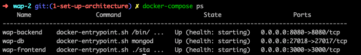
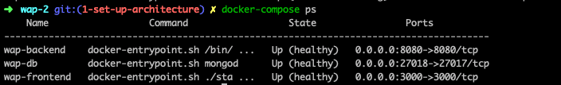

# Feathers Nuxt Docker App

<a id="contents"></a>

# Table of contents

1. [Context](#1)<br>
2. [Architecture and code organization (DDD)](#2)
3. [Installation](#3)<br>
   3.1 [First time process](#3-1)<br>
   3.2 [Usual process](#3-2)
4. [Commands](#4)<br>
   4.1 [Main commands](#4-1)<br>
   4.2 [Other commands](#4-2)
5. [Tools](#5)<br>
   5.1 [FeathersJS](#5-1)<br>
   &nbsp;&nbsp;&nbsp;&nbsp;5.1.1 [Hooks](#5-1-1)<br>
   &nbsp;&nbsp;&nbsp;&nbsp;5.1.2 [Services](#5-1-2)<br>
   5.2 [Docker](#5-2)<br>
   5.3 [MongoDB](#5-3)
6. [Tests](#6)<br>
7. [Fixtures](#7)<br>

<a id="1"></a>

## 1 Context [&#x2B06;](#contents)

This app is a real-time application example, enabling to create content easily.

<a id="2"></a>

## 2 Architecture and code organization (DDD) [&#x2B06;](#contents)

FeathersJS was chosen on the backend for its real-time abilities, but also for its REST API.
Nuxt is the platform consuming the REST API and emitting/listening to real-time events, including a Feathers client.
Nuxt was chosen as a Vue framework, having Vue's simplicity in mind, and enabling powerful features such as SSR, router, state management through Vuex.

As for the database, since there are not many entities and relations, a document-based DB was a good fit. Hence MongoDB.
A proxy server, through Nginx, will also be used.

Every part of the application is dockerized, with a healtcheck status.

On the backend, the artchitecture of the code follows DDD (domain-driven design) principles: separating layers, isolating the domain. This enables to easily change a part of the application, for instance the database, the logger, ... As FeathersJS is a framework, it becomes a central part of this application, thus managing all layers.

The domain is database agnostic, enabling to change the database easily if needed. It is build with Joi, a JS package, enabling traditional data validation but also date comparison, more powerful than JSON schema for example.

<a id="3"></a>

## 3 Installation [&#x2B06;](#contents)

First, you need to have docker and docker-compose installed and launched on your machine. Then, it is quite easy;

- run `git clone git@github.com:falkodev/feathers-nuxt-docker-app.git && cd feathers-nuxt-docker-app`
- copy the file `.env.example` and name it `.env` (this file will contain passwords, and will be git-ignored, so don't try to commit it)
- in this `.env` file, create a password for `MONGO_INITDB_ROOT_PASSWORD` and another one for `MONGO_INITDB_USER_PASSWORD` (choose whatever you want, it does not matter because it will be only available in your machine)
- still in this `.env` file, update `MONGO_DB` to match the password in it with `MONGO_INITDB_USER_PASSWORD` (between `mongodb://app-admin:` and `@app-db:27017/app`) and do not modify `MONGO_INITDB_ROOT_USERNAME` and `MONGO_INITDB_USER_USERNAME`
- run `docker-compose up`

<a id="3-1"></a>

### 3.1 First time process [&#x2B06;](#contents)

The first time you run `docker-compose up`, all Docker images will be downloaded and built.

There is a dependency between the containers `app-backend` and `app-db`: the DB needs to be started to enable the server to start (otherwise, Feathers does not have a Mongo connection and is stuck). However, the first time, database users will be created, it takes time, and the timeout on Feathers side expires. So, read the logs and wait for the user `app-admin` to be created. When it is done, the DB is ready. You can now kill the docker containers by hitting `Ctrl + c` in your terminal or run `docker-compose stop` in another one. And run again `docker-compose up` or `make` as explained below. This time, the DB will start quickly, enabling the server to start correctly.

<a id="3-2"></a>

### 3.2 Usual process [&#x2B06;](#contents)

Run simply `make` to start on development mode. You can also look at the Makefile for other possible commands. The next section explains what commands to run.

<a id="4"></a>

## 4 Commands [&#x2B06;](#contents)

<a id="4-1"></a>

### 4.1 Main commands [&#x2B06;](#contents)

Run `docker-compose up` for production in Docker

- `docker-compose ps` for running instances.
- `docker-compose stop`
- `docker-compose build` to rebuild images
- `docker-compose exec container-name sh` to log into a container (i.e: `docker-compose exec app-backend sh` to log into the server container)

Additionally, there is a Makefile. Therefore, these commands are available:

- `make` will run a `docker-compose up` with NODE_ENV=development and display logs from all containers
- `make build` is also available to build containers after a new package is added in a package.json file (for server and client containers)
- `make rebuild` will force to download all images again, starting from scratch before building containers

<a id="4-2"></a>

### 4.2 Other commands [&#x2B06;](#contents)

Some useful commands are `make db-dump` and `make db-restore` to save the database, and restore backup.

<a id="5"></a>

## 5 Tools [&#x2B06;](#contents)

<a id="5-1"></a>

### 5.1 FeathersJS [&#x2B06;](#contents)

As explained previously, Feathers is a framework for real-time applications and REST APIs. Therefore, no need to create CRUD routes, as it is handled by the framework.

<a id="5-1-1"></a>

#### 5.1.1 Hooks [&#x2B06;](#contents)

However, it is possible to add hooks. They will be triggered before of after events. Global hooks can be found in `server/src/application/server.hooks.js`.

Here is the list:

```js
before: {
  all: [],
  find: [],
  get: [],
  create: [],
  update: [],
  patch: [],
  remove: [],
},

after: {
  all: [],
  find: [],
  get: [],
  create: [],
  update: [],
  patch: [],
  remove: [],
},

error: {
  all: [],
  find: [],
  get: [],
  create: [],
  update: [],
  patch: [],
  remove: [],
}
```

One hook can be customized to react to an event. For example, if I want to log every error, I can do this:

```js
all: [hook => console.log('error catched in hook', hook.error)],
```

As hooks contain array, you can have several elements:

```js
all: [
  hook => {
    console.log('error catched in hook', hook.error)
    return hook
  },
  otherLibraryDealingWithThisHook()
  ],
```

Just remember to return the hook in your custom hook function, so the next function can use it.

<a id="5-1-2"></a>

#### 5.1.2 Services [&#x2B06;](#contents)

Services are the heart of a Feathers app, as it defines routes, controllers, models...
You can have custom routes by modifying the `service` file of your module.
For example, in `users` service, take the `users.service.js` file:

```js
app
  .use('/users', new Users({ paginate: app.get('paginate') }, app))
  .service('users')
  .hooks(hooks)
```

If you need a custom route, you could add 2 sorts of routes:

- `app.use` implementing a `find` method, returning a Promise
- `app.METHOD` (`app.get`, `app.post`, `app.patch`, ...) in an `express` classical way as Feathers is a wrapper over Express (https://expressjs.com)

```js
app
  .use('/users', new Users({ paginate: app.get('paginate') }, app))
  .use('/users/sub/subroute', { find: () => new Promise(resolve => resolve('custom route')) }) // need 2 levels of subrouting as REST APIs have already one level of subrouting for GET requests
  .get('/users/sub/subroute2', (req, res, next) => res.send('custom get'))
  .service('users')
  .hooks(hooks)
```

<a id="5-2"></a>

### 5.2 Docker [&#x2B06;](#contents)

Docker containers have a `healtcheck` command to ensure they are running correctly. It is an ongoing process, checking if the container replies on a regular basis.

You can check if a container is healthy by typing `docker-compose ps`





<a id="5-3"></a>

### 5.3 MongoDB [&#x2B06;](#contents)

The database process uses authentication. The image used for the dockerized Mongo accepts some environment variables:

- MONGO_INITDB_DATABASE
- MONGO_INITDB_ROOT_USERNAME
- MONGO_INITDB_ROOT_PASSWORD

With these, a `root` user for all databases is created when the Mongo image for Docker is launched the first time. This enables authentication.

The Docker image can run scripts at the first initialization.<br>
For example, the script `db/scripts/init/01.add-user.sh` is copied into the image through the Dockerfile in the folder `db`. It creates a user specifically for the `app` database.
That is why the `.env` file is important, and MONGO_INITDB_ROOT_USERNAME and MONGO_INITDB_USER_USERNAME should not be changed.

```Dockerfile
FROM mongo:4.2

COPY scripts/init/01.add-user.sh /docker-entrypoint-initdb.d/
```

If other scripts during the first init step are needed in the future, they should be placed in `db/scripts/init/` and copied the same way in the Dockerfile.

Outside of the Docker network, the port exposed is 27018 (in order not to mess with existing MongoDB in the local machine). Therefore, you can connect to GUI tools such as MongDB Compass or Robo 3T through `mongodb://localhost:27018` and indicate in the authentication settings the `root` credentials.

To log into the container, you can run `docker-compose exec app-db bash` and then `mongo -u root`. Insert the `root` password when it is asked and you have access to the mongo shell.

<a id="6"></a>

## 6 Tests [&#x2B06;](#contents)

Tests are a mix of Jest on backend and frontend and E2E tests with Cypress on frontend.

They can be launched locally by running `npm run test` on root level or through Docker by running `make test`

For a specific service:

- backend: run `make test-backend`
- frontend: run `make test-frontend`

If a watch mode is needed during development:

- for backend: `docker-compose exec app-backend npm run jest:watch` or `cd server && npm run jest:watch`
- for frontend: `docker-compose exec app-frontend npm run jest:watch` or `cd client && npm run jest:watch`

<a id="7"></a>

## 7 Fixtures [&#x2B06;](#contents)

A set of fixtures has been configured to start the application with fake data.

Locally, you can run `cd server && npm run fixtures`.
Through Docker (after the containers have started with `make`), the command is `docker-compose exec app-backend npm run fixtures`.

For a specific fixtures to be launched, you can run `docker-compose exec app-backend npm run fixtures:users` for example, or `node -e 'require(\"./src/infrastructure/fixtures/users\").main()'`.
